# Secure DevSecOps Pipeline Reference Architecture

## Overview

This repository demonstrates a secure software delivery pipeline reference architecture for cloud-hosted applications. It combines a sample full-stack dashboard application with pipeline controls intended to show how teams can reduce delivery risk through layered validation, release discipline, and deployment governance.

The repository is maintained as public, non-commercial technical reference material. It is designed to show practical implementation patterns for secure delivery workflows rather than claim certified compliance or production deployment.

## Problem Statement

Software delivery pipelines can amplify risk when security checks are weak, inconsistent, or applied too late. Common failure points include:

- secrets exposure
- vulnerable dependencies
- weak IaC controls
- unscanned containers
- premature registry publishing
- weak approval gates
- limited audit evidence
- poor rollback planning

## Reference Architecture

```mermaid
flowchart LR
    Source[Source Code] --> Secrets[Secret Scan]
    Secrets --> SAST[SAST / IaC Scan]
    SAST --> Dependencies[Dependency Review]
    Dependencies --> Build[Build / Test]
    Build --> Container[Container Image Scan]
    Container --> Approval[Approval Gate]
    Approval --> Deploy[Controlled Deploy]
    Deploy --> Monitor[Monitoring / Feedback]
    Monitor --> Evidence[Audit Evidence]
```



## Pipeline Security Stages

1. Source control review
2. Secret scanning
3. Dependency review
4. SAST
5. Infrastructure-as-code scanning
6. Build and test
7. Container image scanning
8. SBOM concept
9. Approval gate
10. Controlled deployment
11. Monitoring and feedback
12. Rollback readiness
13. Audit evidence retention

## Technical Implementation

The current repository includes a demonstration dashboard application used to exercise the secure pipeline:

- React frontend
- Express/Node backend
- Docker containerization
- GitHub Actions pipeline
- Security scanning tools where present, including Gitleaks, npm audit, OSV-Scanner, SonarCloud, Checkov, Trivy, Syft, OWASP ZAP, and Docker Bench references
- Terraform infrastructure definitions
- Kubernetes, EKS, Helm, and ArgoCD manifests present in the repository as reference implementation components

## Security Controls

- secret detection
- dependency vulnerability review
- SAST
- IaC validation
- container scanning
- SBOM generation
- approval gates
- audit artifacts
- environment promotion
- rollback planning
- monitoring and health checks

## Cloud Provider Scope

This project uses AWS as the primary implementation and documentation environment because of my AWS certification background and hands-on project history.

Where appropriate, the architecture principles are also mapped conceptually to Microsoft Azure and Google Cloud through comparable areas such as identity, networking, encryption, logging, monitoring, resilience, and security-control implementation.

This repository does not claim full production implementation across all cloud providers unless explicitly documented.

## Public Benefit and National Importance

Cloud systems support U.S. businesses, public services, healthcare operations, education platforms, financial activity, and digital communications. Weak deployment pipelines can quickly amplify security weaknesses by pushing vulnerable code, exposed secrets, insecure containers, or misconfigured infrastructure into cloud environments.

This project contributes public technical reference material that helps explain secure DevSecOps patterns, pipeline security controls, release discipline, rollback planning, and audit evidence practices in a way that can be studied, reused, and adapted by technical teams.

This project is independent, non-commercial, educational, and public-interest technical work.

## Evidence Value

This repository supports a broader technical portfolio demonstrating practical ability in:

- secure software delivery
- DevSecOps automation
- cloud security controls
- infrastructure-as-code review
- container security
- logging and monitoring
- deployment governance
- rollback and recovery planning
- public technical communication

This repository is intended to show practical implementation judgment and technical communication, not to claim certified compliance or production deployment.

## Project Structure

```text
secure-devsecops-pipeline-reference-architecture/
├── .github/workflows/             # CI/CD workflows and security gates
├── argocd/                        # GitOps application manifests
├── client/                        # React demonstration frontend
├── docs/                          # Supporting security documentation
├── evidence/                      # Portfolio evidence notes
├── helm/                          # Helm chart assets for the sample app
├── server/                        # Express API and tests
├── terraform/                     # Infrastructure-as-code reference files
├── docker-compose.yml             # Local container run definition
├── Dockerfile                     # Multi-stage container build
├── jest.config.js                 # Test configuration
├── sonar-project.properties       # Static analysis configuration
└── README.md
```

## Local Development

```bash
git clone https://github.com/Peter-Agbenyega/secure-devsecops-pipeline-reference-architecture.git
cd secure-devsecops-pipeline-reference-architecture
```

Install dependencies:

```bash
cd server
npm install

cd ../client
npm install
```

Run with Docker Compose:

```bash
docker compose up --build
```

Run locally without Docker:

```bash
cd server
npm start
```

```bash
cd client
npm start
```

Run tests:

```bash
cd server
npm test
```

## Running Security Checks Locally

```bash
cd server
npm audit
```

```bash
cd server
npm run lint
```

```bash
gitleaks detect --source .
```

```bash
trivy image secure-devsecops-reference:local
```

```bash
checkov -d .
```

```bash
syft .
```

## Repository Scope

- reference architecture
- demonstration application
- public documentation
- educational DevSecOps pipeline example
- not production certified
- not compliance certified
- no real secrets or client data

## Lessons Learned

- Container scan failures can be driven by bundled runtime dependencies that remain in the final image even when the application code itself is small. Multi-stage builds and package pruning materially reduce this risk.
- Publishing images before security gates complete weakens release discipline. Registry promotion should happen only after required checks succeed and evidence is retained.
- Terraform destroy behavior can be disrupted by unmanaged or externally retained load-balancer dependencies. Infrastructure ownership boundaries need to be explicit before lifecycle operations.
- Kubernetes health probes and rate-limiting controls can interact in ways that create false failure signals during startup or burst traffic. Probe timing and middleware thresholds need coordinated tuning.
- Helm installs can remain in a pending state when prior releases or namespace resources are not cleaned up consistently. Release hygiene matters for repeatable deployments.
- EKS access-entry design needs careful review so cluster access remains explicit, auditable, and aligned with intended operator roles.
- Provider binaries and generated artifacts can be committed accidentally if ignore rules are incomplete. Repository hygiene should treat large binaries and generated providers as validation failures, not minor cleanup items.

## Disclaimer

This repository contains independent, non-commercial technical reference work for educational and public-interest purposes. It does not represent a government system, client system, certified compliance implementation, or production deployment guarantee.
